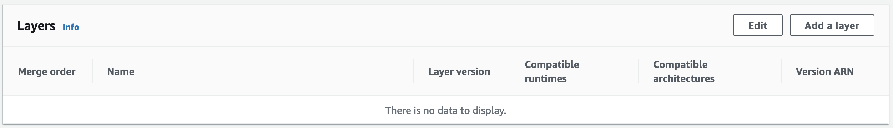
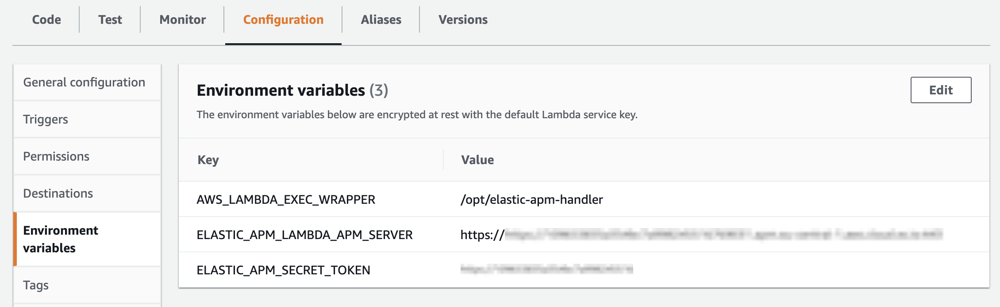

---
mapped_pages:
  - https://www.elastic.co/guide/en/apm/agent/java/current/aws-lambda.html
sub:
  apm-lambda-ext-v: ver-1-5-7
  apm-java-v: ver-1-52-2
---

# Monitoring AWS Lambda Java Functions [aws-lambda]

The Java APM Agent can be used with AWS Lambda to monitor the execution of your AWS Lambda functions.

:::{note}
Note: The Centralized Agent Configuration on the Elasticsearch APM currently does NOT support AWS Lambda.
:::


## Quick Start [aws-lambda-java-quick-start]

To get started with APM for your Java AWS Lambda functions, follow the steps below.


### Prerequisites [aws-lambda-java-prerequisites]

1. You need an APM Server to send APM data to. Follow the [APM Quick start](docs-content://solutions/observability/apm/get-started.md) if you have not set one up yet. For the best-possible performance, we recommend setting up APM on {{ecloud}} in the same AWS region as your AWS Lambda functions.
2. Make sure you are using one of the supported AWS Lambda Java runtimes:

    | Tags  | Java Runtime       | Operating System | Supported |
    |-------|--------------------| --- | --- |
    | 21    | Java 21 (Corretto)  | Amazon Linux 2023 | yes |
    | 17    | Java 17 (Corretto)  | Amazon Linux 2 | yes |
    | 11    | Java 11 (Corretto) | Amazon Linux 2 | yes |
    | 8.al2 | Java 8 (Corretto)  | Amazon Linux 2 | yes |
    | 8     | Java 8 (OpenJDK)   | Amazon Linux 2018.03 | no |


### Step 1: Add the APM Layers to your Lambda function [add_the_apm_layers_to_your_lambda_function]

Both the [{{apm-lambda-ext}}](apm-aws-lambda://reference/index.md) and the Java APM Agent are added to your Lambda function as [AWS Lambda Layers](https://docs.aws.amazon.com/lambda/latest/dg/invocation-layers.md). Therefore, you need to add the corresponding Layer ARNs (identifiers) to your Lambda function.

:::::::{tab-set}

::::::{tab-item} AWS Web Console
To add the layers to your Lambda function through the AWS Management Console:

1. Navigate to your function in the AWS Management Console
2. Scroll to the Layers section and click the *Add a layer* button 
3. Choose the *Specify an ARN* radio button
4. Copy and paste the following ARNs of the {{apm-lambda-ext}} layer and the APM agent layer in the *Specify an ARN* text input:
    * APM Extension layer:
      ```
      arn:aws:lambda:{AWS_REGION}:267093732750:layer:elastic-apm-extension-{{apm-lambda-ext-v}}-{ARCHITECTURE}:1 <1>
      ```
      1. Replace `{AWS_REGION}` with the AWS region of your Lambda function and `{ARCHITECTURE}` with its architecture.

    * APM agent layer:
      ```
      arn:aws:lambda:{AWS_REGION}:267093732750:layer:elastic-apm-java-{{apm-java-v}}:1 <1>
      ```
      1. Replace `{AWS_REGION}` with the AWS region of your Lambda function.
5. Click the *Add* button
::::::

::::::{tab-item} AWS CLI
To add the Layer ARNs of the {{apm-lambda-ext}} and the APM agent through the AWS command line interface execute the following command:

```bash
aws lambda update-function-configuration --function-name yourLambdaFunctionName \
--layers arn:aws:lambda:{AWS_REGION}:267093732750:layer:elastic-apm-extension-{{apm-lambda-ext-v}}-{ARCHITECTURE}:1 \ <1>
arn:aws:lambda:{AWS_REGION}:267093732750:layer:elastic-apm-java-{{apm-java-v}}:1 <2>
```
1. Replace `{AWS_REGION}` with the AWS region of your Lambda function and `{ARCHITECTURE}` with its architecture.
2. Replace `{AWS_REGION}` with the AWS region of your Lambda function.
::::::

::::::{tab-item} SAM
In your SAM `template.yml` file add the Layer ARNs of the {{apm-lambda-ext}} and the APM agent as follows:

```yaml
...
Resources:
  yourLambdaFunction:
    Type: AWS::Serverless::Function
    Properties:
      ...
      Layers:
          - arn:aws:lambda:{AWS_REGION}:267093732750:layer:elastic-apm-extension-{{apm-lambda-ext-v}}-{ARCHITECTURE}:1
          - arn:aws:lambda:{AWS_REGION}:267093732750:layer:elastic-apm-java-{{apm-java-v}}:1 <2>
...
```
1. Replace `{AWS_REGION}` with the AWS region of your Lambda function and `{ARCHITECTURE}` with its architecture.
2. Replace `{AWS_REGION}` with the AWS region of your Lambda function.
::::::

::::::{tab-item} Serverless
In your `serverless.yml` file add the Layer ARNs of the {{apm-lambda-ext}} and the APM agent to your function as follows:

```yaml
...
functions:
  yourLambdaFunction:
    handler: ...
    layers:
      - arn:aws:lambda:{AWS_REGION}:267093732750:layer:elastic-apm-extension-{{apm-lambda-ext-v}}-{ARCHITECTURE}:1
      - arn:aws:lambda:{AWS_REGION}:267093732750:layer:elastic-apm-java-{{apm-java-v}}:1 <2>
...
```
1. Replace `{AWS_REGION}` with the AWS region of your Lambda function and `{ARCHITECTURE}` with its architecture.
2. Replace `{AWS_REGION}` with the AWS region of your Lambda function.
::::::

::::::{tab-item} Terraform
To add the{{apm-lambda-ext}} and the APM agent to your function add the ARNs to the `layers` property in your Terraform file:

```yaml
...
resource "aws_lambda_function" "your_lambda_function" {
  ...
  layers = ["arn:aws:lambda:{AWS_REGION}:267093732750:layer:elastic-apm-extension-{{apm-lambda-ext-v}}-{ARCHITECTURE}:1", "arn:aws:lambda:{AWS_REGION}:267093732750:layer:elastic-apm-java-{{apm-java-v}}:1"] <1>
}
...
```
1. Replace `{AWS_REGION}` with the AWS region of your Lambda function and `{ARCHITECTURE}` with its architecture.
::::::

::::::{tab-item} Container Image
To add the {{apm-lambda-ext}} and the APM agent to your container-based function extend the Dockerfile of your function image as follows:

```Dockerfile
FROM docker.elastic.co/observability/apm-lambda-extension-IMAGE_ARCH:latest AS lambda-extension
FROM docker.elastic.co/observability/apm-agent-java:latest AS java-agent

# FROM ...  <-- this is the base image of your Lambda function

COPY --from=lambda-extension /opt/elastic-apm-extension /opt/extensions/elastic-apm-extension
COPY --from=java-agent /usr/agent/ /opt/

# ...
```
::::::

:::::::

### Step 2: Configure APM on AWS Lambda [configure_apm_on_aws_lambda]

The {{apm-lambda-ext}} and the APM Java agent are configured through environment variables on the AWS Lambda function.

For the minimal configuration, you will need the *APM Server URL* to set the destination for APM data and an [APM Secret Token](docs-content://solutions/observability/apm/secret-token.md). If you prefer to use an [APM API key](docs-content://solutions/observability/apm/api-keys.md) instead of the APM secret token, use the `ELASTIC_APM_API_KEY` environment variable instead of `ELASTIC_APM_SECRET_TOKEN` in the following configuration.

For production environments, we recommend [using the AWS Secrets Manager to store your APM authentication key](apm-aws-lambda://reference/aws-lambda-secrets-manager.md) instead of providing the secret value as plaintext in the environment variables.

:::::::{tab-set}

::::::{tab-item} AWS Web Console
To configure APM through the AWS Management Console:

1. Navigate to your function in the AWS Management Console
2. Click on the *Configuration* tab
3. Click on *Environment variables*
4. Add the following required variables:

```bash
AWS_LAMBDA_EXEC_WRAPPER       = /opt/elastic-apm-handler  <1>
ELASTIC_APM_LAMBDA_APM_SERVER = <YOUR-APM-SERVER-URL>     <2>
ELASTIC_APM_SECRET_TOKEN      = <YOUR-APM-SECRET-TOKEN>   <3>
ELASTIC_APM_SEND_STRATEGY     = background                <4>
```

1. Use this exact fixed value.
2. This is your APM Server URL.
3. This is your APM secret token.
4. The [ELASTIC_APM_SEND_STRATEGY](apm-aws-lambda://reference/aws-lambda-config-options.md#_elastic_apm_send_strategy) defines when APM data is sent to your Elastic APM backend. To reduce the execution time of your lambda functions, we recommend to use the background strategy in production environments with steady load scenarios.


::::::

::::::{tab-item} AWS CLI
To configure APM through the AWS command line interface execute the following command:

```bash
aws lambda update-function-configuration --function-name yourLambdaFunctionName \
    --environment "Variables={AWS_LAMBDA_EXEC_WRAPPER=/opt/elastic-apm-handler,ELASTIC_APM_LAMBDA_APM_SERVER=<YOUR-APM-SERVER-URL>,ELASTIC_APM_SECRET_TOKEN=<YOUR-APM-SECRET-TOKEN>,ELASTIC_APM_SEND_STRATEGY=background}" <1>
```

1. The [ELASTIC_APM_SEND_STRATEGY](apm-aws-lambda://reference/aws-lambda-config-options.md#_elastic_apm_send_strategy) defines when APM data is sent to your Elastic APM backend. To reduce the execution time of your lambda functions, we recommend to use the background strategy in production environments with steady load scenarios.

::::::

::::::{tab-item} SAM
In your SAM `template.yml` file configure the following environment variables:

```yaml
...
Resources:
  yourLambdaFunction:
    Type: AWS::Serverless::Function
    Properties:
      ...
      Environment:
          Variables:
            AWS_LAMBDA_EXEC_WRAPPER: /opt/elastic-apm-handler
            ELASTIC_APM_LAMBDA_APM_SERVER: <YOUR-APM-SERVER-URL>
            ELASTIC_APM_SECRET_TOKEN: <YOUR-APM-SECRET-TOKEN>
            ELASTIC_APM_SEND_STRATEGY: background <1>
...
```

1. The [ELASTIC_APM_SEND_STRATEGY](apm-aws-lambda://reference/aws-lambda-config-options.md#_elastic_apm_send_strategy) defines when APM data is sent to your Elastic APM backend. To reduce the execution time of your lambda functions, we recommend to use the background strategy in production environments with steady load scenarios.

::::::

::::::{tab-item} Serverless
In your `serverless.yml` file configure the following environment variables:

```yaml
...
functions:
  yourLambdaFunction:
    ...
    environment:
      AWS_LAMBDA_EXEC_WRAPPER: /opt/elastic-apm-handler
      ELASTIC_APM_LAMBDA_APM_SERVER: <YOUR-APM-SERVER-URL>
      ELASTIC_APM_SECRET_TOKEN: <YOUR-APM-SECRET-TOKEN>
      ELASTIC_APM_SEND_STRATEGY: background <1>
...
```

1. The [ELASTIC_APM_SEND_STRATEGY](apm-aws-lambda://reference/aws-lambda-config-options.md#_elastic_apm_send_strategy) defines when APM data is sent to your Elastic APM backend. To reduce the execution time of your lambda functions, we recommend to use the background strategy in production environments with steady load scenarios.

::::::

::::::{tab-item} Terraform
In your Terraform file configure the following environment variables:

```yaml
...
resource "aws_lambda_function" "your_lambda_function" {
  ...
  environment {
    variables = {
      AWS_LAMBDA_EXEC_WRAPPER       = "/opt/elastic-apm-handler"
      ELASTIC_APM_LAMBDA_APM_SERVER = "<YOUR-APM-SERVER-URL>"
      ELASTIC_APM_SECRET_TOKEN      = "<YOUR-APM-SECRET-TOKEN>"
      ELASTIC_APM_SEND_STRATEGY     = "background" <1>
    }
  }
}
...
```

1. The [ELASTIC_APM_SEND_STRATEGY](apm-aws-lambda://reference/aws-lambda-config-options.md#_elastic_apm_send_strategy) defines when APM data is sent to your Elastic APM backend. To reduce the execution time of your lambda functions, we recommend to use the background strategy in production environments with steady load scenarios.

::::::

::::::{tab-item} Container Image
Environment variables configured for an AWS Lambda function are passed to the container running the lambda function. You can use one of the other options (through AWS Web Console, AWS CLI, etc.) to configure the environment variables or [define them directly in your Dockerfile](https://docs.docker.com/engine/reference/builder/#env).

We recommend to use an [official AWS Lambda base image](https://gallery.ecr.aws/lambda/java) for your function’s container image. In this case, you will only need to configure the following three environment variables:

```bash
AWS_LAMBDA_EXEC_WRAPPER       = "/opt/elastic-apm-handler"
ELASTIC_APM_LAMBDA_APM_SERVER = <YOUR-APM-SERVER-URL>     <1>
ELASTIC_APM_SECRET_TOKEN      = <YOUR-APM-SECRET-TOKEN>   <2>
ELASTIC_APM_SEND_STRATEGY     = "background"              <3>
```

1. This is your APM Server URL.
2. This is your APM secret token.
3. The [ELASTIC_APM_SEND_STRATEGY](apm-aws-lambda://reference/aws-lambda-config-options.md#_elastic_apm_send_strategy) defines when APM data is sent to your Elastic APM backend. To reduce the execution time of your lambda functions, we recommend to use the background strategy in production environments with steady load scenarios.

If your container image is based on a different base image (not including the AWS Lambda runtime utilities), the `AWS_LAMBDA_EXEC_WRAPPER` configuration option won’t be supported. In this case, you will need to define an extended set of environment variables (which, in the above case, are set through the wrapper script):

```bash
JAVA_TOOL_OPTIONS              = "-javaagent:/opt/elastic-apm-agent.jar"
ELASTIC_APM_AWS_LAMBDA_HANDLER = <HANDLER_CLASS_NAME>     <1>
ELASTIC_APM_METRICS_INTERVAL   = "0s"
ELASTIC_APM_CENTRAL_CONFIG     = "false"
ELASTIC_APM_CLOUD_PROVIDER     = "none"
ELASTIC_APM_LAMBDA_APM_SERVER  = <YOUR-APM-SERVER-URL>    <2>
ELASTIC_APM_SECRET_TOKEN       = <YOUR-APM-SECRET-TOKEN>  <3>
ELASTIC_APM_SEND_STRATEGY      = "background"
```

1. The fully qualified class name of your Lambda handler.
2. This is your APM Server URL.
3. This is your APM secret token.
4. The [ELASTIC_APM_SEND_STRATEGY](apm-aws-lambda://reference/aws-lambda-config-options.md#_elastic_apm_send_strategy) defines when APM data is sent to your Elastic APM backend. To reduce the execution time of your lambda functions, we recommend to use the background strategy in production environments with steady load scenarios.

::::::

:::::::
1. The [`ELASTIC_APM_SEND_STRATEGY`](apm-aws-lambda://reference/aws-lambda-config-options.md#_elastic_apm_send_strategy) defines when APM data is sent to your Elastic APM backend. To reduce the execution time of your lambda functions, we recommend to use the `background` strategy in production environments with steady load scenarios.


You can optionally [fine-tune the Java agent ](/reference/configuration.md) or the [configuration of the {{apm-lambda-ext}}](apm-aws-lambda://reference/aws-lambda-config-options.md).

That’s it; After following the steps above, you’re ready to go! Your Lambda function invocations should be traced from now on.

Read on to learn more about the features and limitations of the Java APM Agent on AWS Lambda Functions.


## Features and Caveats [aws-lambda-features-and-caveats]

The AWS Lambda as a runtime behaves differently from conventional runtimes. While most APM and monitoring concepts apply to AWS Lambda, there are a few differences and limitations to be aware of.


### Performance monitoring [aws-lambda-performance-monitoring]

Elastic APM automatically measures the performance of your lambda function executions. It records traces for database queries, external HTTP requests, and other slow operations that happen during execution.

By default, the agent will trace [the usual supported technologies](/reference/set-up-apm-java-agent.md#supported-technologies). To trace other events, take a look at [additional method tracing options](/reference/how-to-find-slow-methods.md), however note that due to its asynchronous nature, the [Sampling Profiler](/reference/method-sampling-based.md) is not a valid option for AWS Lambda.


### Error monitoring [aws-lambda-error-monitoring]

Whenever an `Exception` is thrown by your function handler method, the agent will send an error event to the APM Server and the corresponding transaction will be recorded as a failed transaction. Errors related to traced spans will be sent as well.


### Caveats [aws-lambda-caveats]

* System and custom metrics are not collected for Lambda functions. This is both because most of those are irrelevant and because the interval-based event sending model is not suitable for FaaS environments.
* Central Configuration is disabled, which means that the APM agent configuration cannot be changed without redefining the lambda environment variables or APM agent settings.
* Cold starts can be significantly slower when the agent is installed. If this is an issue, following are ways to deal with slow code starts:

    * If the only issue with slower cold starts is Lambda timing out, consider increasing the configured timeout.
    * The higher memory limit you would allow for your Function, the smaller this effect would be. This is irrelevant for subsequent Function invocations, it is only relevant for cold starts.
    * Much of the startup delay is related to the amount of enabled instrumentations. An enabled instrumentation will contribute to this overhead regardless of it being applicable for your specific Lambda function. You can considerably reduce the related overhead by specifying a limited list of enabled instrumentations through the [`enable_instrumentations`](/reference/config-core.md#config-enable-instrumentations) config. An automatic way to generate such list is by invoking your Lambda with the agent’s default configurations and a [`log_level`](/reference/config-logging.md#config-log-level) of `INFO` or lower. After the first lambda invocation, the agent would log a message with the following format: `Used instrumentation groups: [aws-lambda, executor, executor-collection, fork-join, ssl-context, urlconnection]`.

* The [Sampling Profiler](/reference/method-sampling-based.md) feature would not work because it relies on profiling sessions and subsequent asynchronous processing of the collected data.

